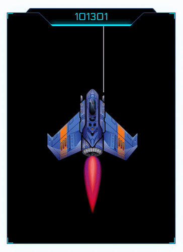

    

<table border="0" style="boder-color: #FFF">
 <tr>
    <td width="255px"></td>
    <td>
    Tezos Academy is a fun interactive tutorial develloped by <a href="https://octo.com/" target="_blank">OCTO Technology</a> on how to code smart contracts for <a href="https://tezos.com/" target="_blank">Tezos</a>. You are about to create a spaceship battle smart contract!  
    By default, Tezos smart contracts are written in <a href="https://tezos.gitlab.io/whitedoc/michelson.html" target="_blank">Michelson</a>, but it is an hard to learn low level formal language. That is why we decide for this tutorial to use <a href="https://ligolang.org/" target="_blank">PascaLIGO</a> instead. The syntax is high level, close to Pascal and tranpiles to Michelson.  
    In this tutorial, you are going to build a "Ship Factory" to build an army of spaceships, then we will add more and more functionalities as you progress through the tutorial, such as going into space battles!
    </td>
 </tr>
</table>
